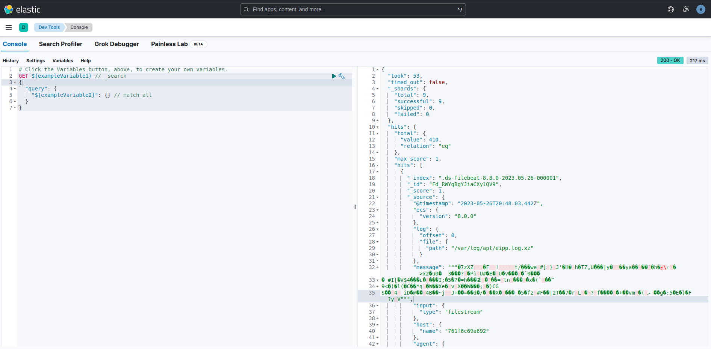
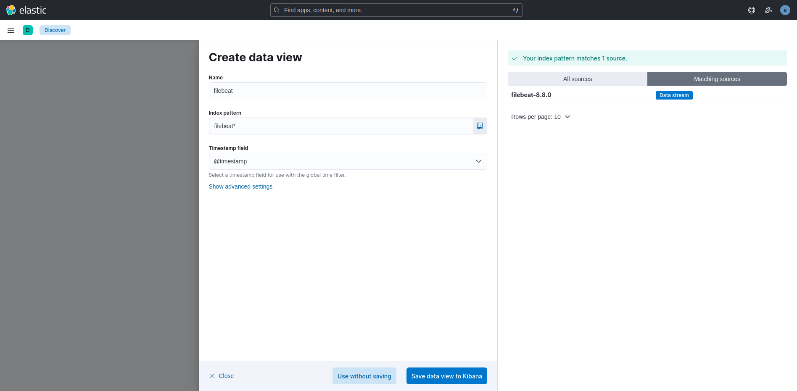
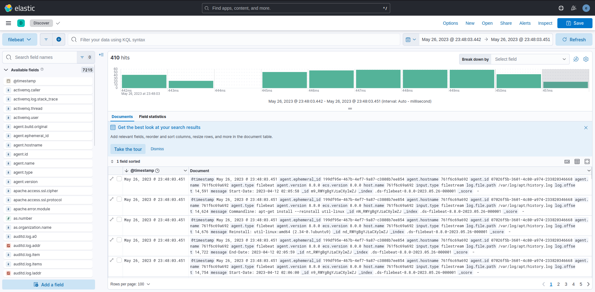

# Развертывание системы мониторинга ELK Stack (ElasticSearch)
Гуляев Степан БИСО-01-20

## Цель работы

1.  Освоить базовые подходы централизованного сбора и накопления
    информации

2.  Освоить современные инструменты развертывания контейнирозованных
    приложений

3.  Закрепить знания о современных сетевых протоколах прикладного уровня

## Исходные данные

1.Компьютер с Windows 10

2.Виртуальная машина с Fedora 38

3.Docker

## Задание

1.Развернуть систему мониторинга на базе Elasticsearch

-   Elasticsearch

-   Beats (Filebeat, Packetbeat)

-   Kibana

2.Настроить сбор информации о сетевом трафике

3.Настроить сбор информации из файлов журналов (лог-файлов)

4.Оформить отчет в соответствии с шаблоном

## Ход работы

### Шаг 1

Docker - система “легкой виртуализации”, позволяющая запускать
приложения в изолированных контейнерах.

Docker позволяет загружать заранее подготовленные контейнеры
мейнтейнерами (разработчиками) прямо из Интернета (команда docker pull),
минуя длительные этапы предварительной настройки программного окружения
и программных зависимостей.

Для удобства развёртывания был использован docker-compose.

Для работы ElasticSearch требуется увеличить размер виртуальной памяти:

``` bash
sudo sysctl -w vm.max_map_count=262144
```

### Шаг 2

Следует подготовить файл с переменными окружения для конфигурации
развертываемых сервисов (файл .env):

    ELASTIC_PASSWORD=stepan
    KIBANA_PASSWORD=stepan
    STACK_VERSION=8.8.0
    CLUSTER_NAME=docker-cluster
    LICENSE=basic
    ES_PORT=9200
    KIBANA_PORT=5601
    MEM_LIMIT=1073741824

### Шаг 3

Был создан сервис для создания сертификатов:

``` yml
  setup:
    image: elasticsearch:${STACK_VERSION}
    volumes:
      - certs:/usr/share/elasticsearch/config/certs
    user: "0"
    command: >
      bash -c '
        if [ x${ELASTIC_PASSWORD} == x ]; then
          echo "Set the ELASTIC_PASSWORD environment variable in the .env file";
          exit 1;
        elif [ x${KIBANA_PASSWORD} == x ]; then
          echo "Set the KIBANA_PASSWORD environment variable in the .env file";
          exit 1;
        fi;
        if [ ! -f config/certs/ca.zip ]; then
          echo "Creating CA";
          bin/elasticsearch-certutil ca --silent --pem -out config/certs/ca.zip;
          unzip config/certs/ca.zip -d config/certs;
        fi;
        if [ ! -f config/certs/certs.zip ]; then
          echo "Creating certs";
          echo -ne \
          "instances:\n"\
          "  - name: es\n"\
          "    dns:\n"\
          "      - es\n"\
          "      - localhost\n"\
          "    ip:\n"\
          "      - 127.0.0.1\n"\
          "  - name: filebeat\n"\
          "    dns:\n"\
          "      - es01\n"\
          "      - localhost\n"\
          "    ip:\n"\
          "      - 127.0.0.1\n"\
          "  - name: packetbeat\n"\
          "    dns:\n"\
          "      - es01\n"\
          "      - localhost\n"\
          "    ip:\n"\
          "      - 127.0.0.1\n"\
          > config/certs/instances.yml;
          > config/certs/instances.yml;
          bin/elasticsearch-certutil cert --silent --pem -out config/certs/certs.zip --in config/certs/instances.yml --ca-cert config/certs/ca/ca.crt --ca-key config/certs/ca/ca.key;
          unzip config/certs/certs.zip -d config/certs;
        fi;
        echo "Setting file permissions"
        chown -R root:root config/certs;
        find . -type d -exec chmod 750 \{\} \;;
        find . -type f -exec chmod 640 \{\} \;;
        echo "Waiting for Elasticsearch availability";
        until curl -s --cacert config/certs/ca/ca.crt https://es:9200 | grep -q "missing authentication credentials"; do sleep 30; done;
        echo "Setting kibana_system password";
        until curl -s -X POST --cacert config/certs/ca/ca.crt -u "elastic:${ELASTIC_PASSWORD}" -H "Content-Type: application/json" https://es:9200/_security/user/kibana_system/_password -d "{\"password\":\"${KIBANA_PASSWORD}\"}" | grep -q "^{}"; do sleep 10; done;
        echo "All done!";
      '
    healthcheck:
      test: ["CMD-SHELL", "[ -f config/certs/es/es.crt ]"]
      interval: 1s
      timeout: 5s
      retries: 120
```

### Шаг 4

Создадим сервис для Elasticsearch и Kibana:

``` yml
  es:
    depends_on:
      setup:
        condition: service_healthy
    image: elasticsearch:${STACK_VERSION}
    volumes:
      - certs:/usr/share/elasticsearch/config/certs
      - esdata:/usr/share/elasticsearch/data
    ports:
      - ${ES_PORT}:9200
    environment:
      - node.name=es
      - cluster.name=${CLUSTER_NAME}
      - cluster.initial_master_nodes=es
      - ELASTIC_PASSWORD=${ELASTIC_PASSWORD}
      - bootstrap.memory_lock=true
      - xpack.security.enabled=true
      - xpack.security.http.ssl.enabled=true
      - xpack.security.http.ssl.key=certs/es/es.key
      - xpack.security.http.ssl.certificate=certs/es/es.crt
      - xpack.security.http.ssl.certificate_authorities=certs/ca/ca.crt
      - xpack.security.transport.ssl.enabled=true
      - xpack.security.transport.ssl.key=certs/es/es.key
      - xpack.security.transport.ssl.certificate=certs/es/es.crt
      - xpack.security.transport.ssl.certificate_authorities=certs/ca/ca.crt
      - xpack.security.transport.ssl.verification_mode=certificate
      - xpack.license.self_generated.type=${LICENSE}
    mem_limit: ${MEM_LIMIT}
    ulimits:
      memlock:
        soft: -1
        hard: -1
    healthcheck:
      test:
        [
          "CMD-SHELL",
          "curl -s --cacert config/certs/ca/ca.crt https://localhost:9200 | grep -q 'missing authentication credentials'",
        ]
      interval: 10s
      timeout: 10s
      retries: 120

 kibana:
    depends_on:
      es:
        condition: service_healthy
    image: elastic/kibana:${STACK_VERSION}
    volumes:
      - certs:/usr/share/kibana/config/certs
      - kibanadata:/usr/share/kibana/data
    ports:
      - ${KIBANA_PORT}:5601
    environment:
      - SERVERNAME=kibana
      - ELASTICSEARCH_HOSTS=https://es:9200
      - ELASTICSEARCH_USERNAME=kibana_system
      - ELASTICSEARCH_PASSWORD=${KIBANA_PASSWORD}
      - ELASTICSEARCH_SSL_CERTIFICATEAUTHORITIES=config/certs/ca/ca.crt
    mem_limit: ${MEM_LIMIT}
    healthcheck:
      test:
        [
          "CMD-SHELL",
          "curl -s -I http://localhost:5601 | grep -q 'HTTP/1.1 302 Found'",
        ]
      interval: 10s
      timeout: 10s
      retries: 120
```

### Шаг 5

Следующим шагом является установка и настройка средств сбора информации.

Сервис Filebeat:

``` yml
  filebeat:
    depends_on:
      es:
        condition: service_healthy
    image: elastic/filebeat:${STACK_VERSION}
    container_name: filebeat
    volumes:
    - ./filebeat.yml:/usr/share/filebeat/filebeat.yml
    - ./logs/:/var/log/app_logs/
    - certs:/usr/share/elasticsearch/config/certs
    environment:
    - ELASTICSEARCH_HOSTS=https://es:9200
    - ELASTICSEARCH_USERNAME=elastic
    - ELASTICSEARCH_PASSWORD=${ELASTIC_PASSWORD}
    - ELASTICSEARCH_SSL_CERTIFICATEAUTHORITIES=config/certs/ca/ca.crt
```

Содержимое файла конфигурации filebeat.yml:

``` yml
filebeat.inputs:
- type: filestream
  id: sys-logs
  enabled: true
  paths:
    - /var/log/app_logs/*

output.elasticsearch:
  hosts: '${ELASTICSEARCH_HOSTS:elasticsearch:9200}'
  username: '${ELASTICSEARCH_USERNAME:}'
  password: '${ELASTICSEARCH_PASSWORD:}'
  ssl:
    certificate_authorities: "/usr/share/elasticsearch/config/certs/ca/ca.crt"
    certificate: "/usr/share/elasticsearch/config/certs/filebeat/filebeat.crt"
    key: "/usr/share/elasticsearch/config/certs/filebeat/filebeat.key"
```

Сервис Packetbeat:

``` yml
  packetbeat:
    depends_on:
      es:
        condition: service_healthy
    image: elastic/packetbeat:${STACK_VERSION}
    container_name: packetbeat
    user: root
    cap_add: ['NET_RAW', 'NET_ADMIN']
    volumes:
    - ./packetbeat.yml:/usr/share/packetbeat/packetbeat.yml
    - certs:/usr/share/elasticsearch/config/certs
    - /var/run/docker.sock:/var/run/docker.sock
    environment:
    - ELASTICSEARCH_HOSTS=https://es:9200
    - ELASTICSEARCH_USERNAME=elastic
    - ELASTICSEARCH_PASSWORD=${ELASTIC_PASSWORD}
    - ELASTICSEARCH_SSL_CERTIFICATEAUTHORITIES=config/certs/ca/ca.crt
```

Сервису packetbeat требуется повышение привелегий для получения доступа
к сети контейнеров, за что отвечает параметр cap_add. Также необходимо
прописать доступ к сокету Docker – таким образом сбор сетевой трафика
будет проводиться по всем контейнерам.

Файл конфигурации:

``` yml
packetbeat.interfaces.device: any

packetbeat.flows:
  timeout: 30s
  period: 10s

packetbeat.protocols.http:
  ports: [80, 5601, 9200, 8080, 8081, 5000, 8002]

processors:
- add_cloud_metadata: ~

output.elasticsearch:
  hosts: '${ELASTICSEARCH_HOSTS:elasticsearch:9200}'
  username: '${ELASTICSEARCH_USERNAME:}'
  password: '${ELASTICSEARCH_PASSWORD:}'
  ssl:
    certificate_authorities: "/usr/share/elasticsearch/config/certs/ca/ca.crt"
    certificate: "/usr/share/elasticsearch/config/certs/packetbeat/packetbeat.crt"
    key: "/usr/share/elasticsearch/config/certs/packetbeat/packetbeat.key"
```

### Шаг 6

Запуск сервисов:

``` bash
docker-compose up -d
[+] Building 0.0s (0/0)
[+] Running 10/10
 ✔ Network docker_default      Created            0.1s 
 ✔ Volume "docker_certs"       Created            0.0s 
 ✔ Volume "docker_esdata"      Created                               0.0s 
 ✔ Volume "docker_kibanadata"  Created               0.0s 
 ✔ Container docker-setup-1    Healthy                6.4s 
 ✔ Container nginx             Started              0.9s 
 ✔ Container docker-es-1       Healthy         37.1s 
 ✔ Container docker-kibana-1   Started        37.8s 
 ✔ Container packetbeat        Started             37.7s 
 ✔ Container filebeat          Started           37.8s
```

### Шаг 7

Войдём в дэшборд и запустим консоль




### Шаг 8

Доавбим Data View для систем сбора информации:






## Оценка результата

Была успешно развёрнута система мониторинга на базе Elasticsearch.

Был настроен сбор информации из файлов журналов.

Был настроен сбор информации о сетевом трафике.

## Вывод

В результате выполнения лабораторной работы были освоены базовые подходы
централизованного сбора и накопления информации, современные инструменты
развертывания контейнирозованных приложений и закреплены знания о
современных сетевых протоколах прикладного уровня.
