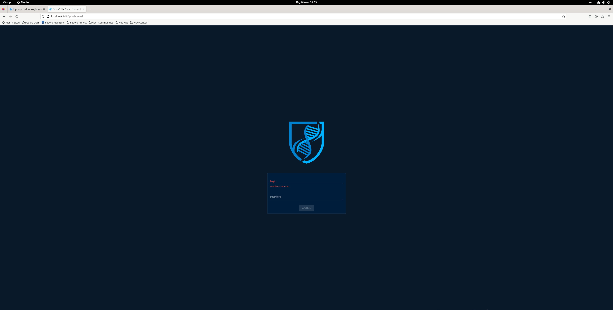
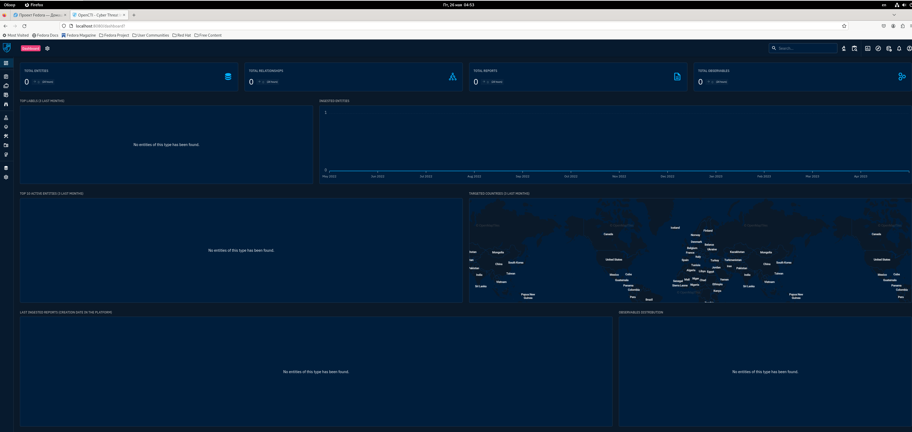
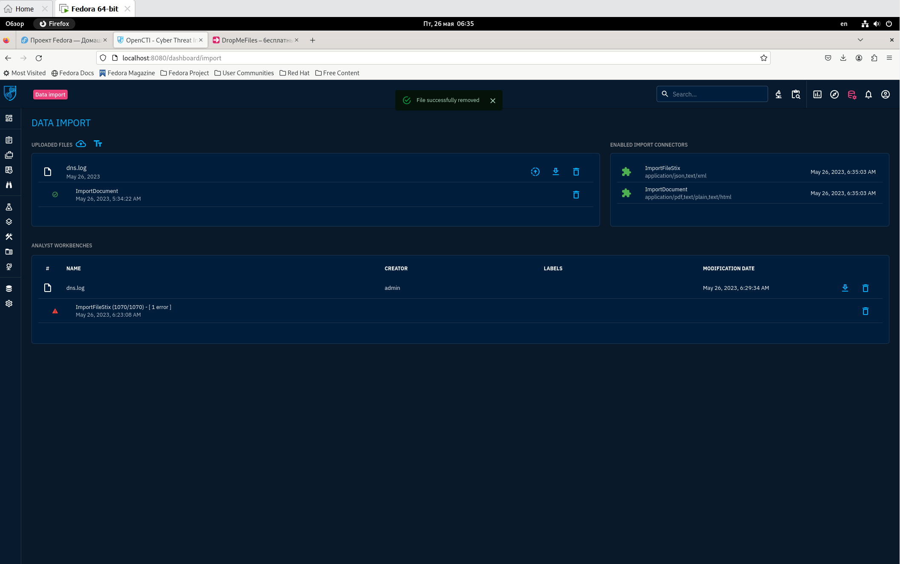
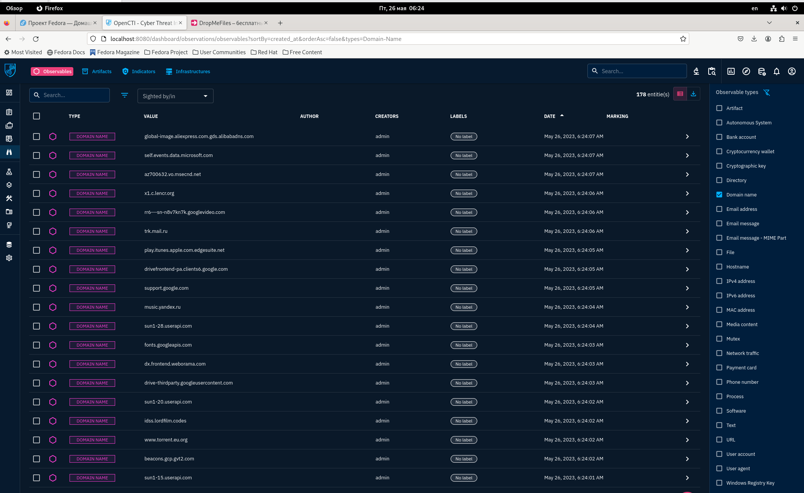
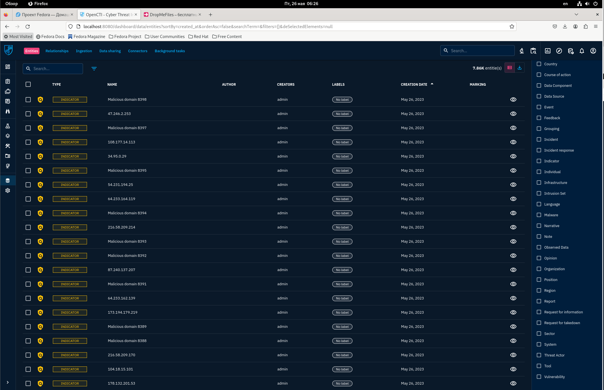
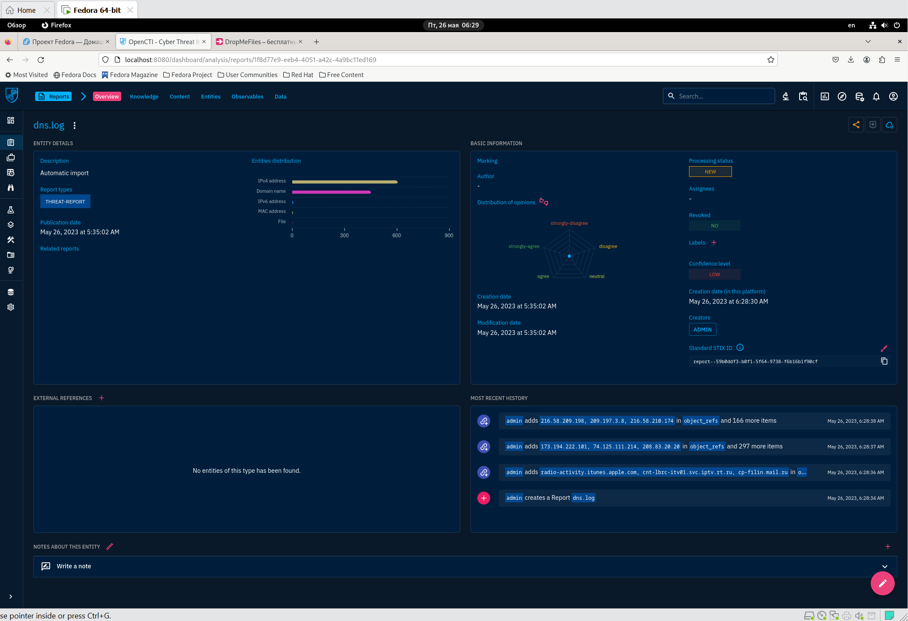
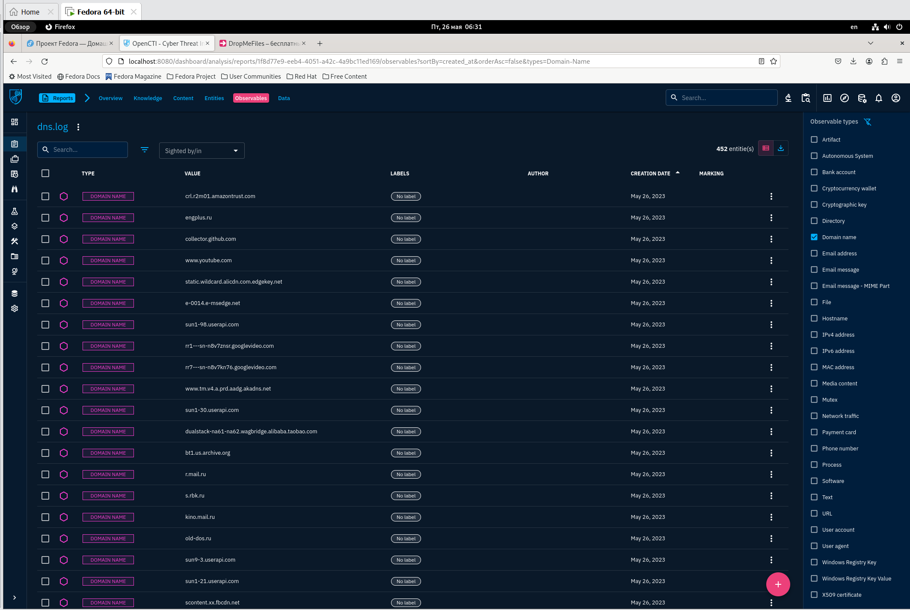

# Развертывание Threat intelligence Platform OpenCTI
Гуляев Степан БИСО-01-20

## Цель работы

1.  Освоить базовые подходы процессов Threat Intelligence

2.  Освоить современные инструменты развертывания контейнеризованных
    приложений

3.  Получить навыки поиска информации об угрозах ИБ

## Исходные данные

1.Компьютер с Windows 10

2.Виртуальная машина на VMBox с ОС Fedora 38

1.  Docker

## Ход работы

### Шаг 1

Для работы ElasticSearch требуется увеличить размер виртуальной памяти
системы:

``` bash
    sudo sysctl -w vm.max_map_count=262144
```

### Шаг 2

Склонируем репозиторий, который содержит OpenCTI-Platform

``` bash
[stepan@fedora ~]$ sudo git clone https://github.com/OpenCTI-Platform/docker.git
```

### Шаг 3

Создам файл .env на основе .env.sample

``` bash
sudo mv .env.sample .env
```

Сгенерирую UUID и добавлю его в .env

``` bash
[stepan@fedora docker]$ cat /proc/sys/kernel/random/uuid 
```

    OPENCTI_ADMIN_EMAIL=admin@opencti.io
    OPENCTI_ADMIN_PASSWORD=changeme
    OPENCTI_ADMIN_TOKEN=42f4bc5e-fa43-4dbb-85cd-73349c0d9117
    OPENCTI_BASE_URL=http://localhost:8080
    MINIO_ROOT_USER=opencti
    MINIO_ROOT_PASSWORD=changeme
    RABBITMQ_DEFAULT_USER=opencti
    RABBITMQ_DEFAULT_PASS=changeme
    CONNECTOR_EXPORT_FILE_STIX_ID=dd817c8b-abae-460a-9ebc-97b1551e70e6
    CONNECTOR_EXPORT_FILE_CSV_ID=7ba187fb-fde8-4063-92b5-c3da34060dd7
    CONNECTOR_EXPORT_FILE_TXT_ID=ca715d9c-bd64-4351-91db-33a8d728a58b
    CONNECTOR_IMPORT_FILE_STIX_ID=72327164-0b35-482b-b5d6-a5a3f76b845f
    CONNECTOR_IMPORT_DOCUMENT_ID=c3970f8a-ce4b-4497-a381-20b7256f56f0
    SMTP_HOSTNAME=localhost
    ELASTIC_MEMORY_SIZE=4G

### Шаг 4

Запущу Docker compose и проверю его сборку

``` bash
[stepan@fedora docker]$ sudo docker-compose up -d
[sudo] пароль для stepan: 
Pulling elasticsearch (docker.elastic.co/elasticsearch/elasticsearch:8.7.1)...
8.7.1: Pulling from elasticsearch/elasticsearch
8d2cded47a25: Pull complete
4eb7c3ccec8d: Pull complete
0f40ad4df92c: Pull complete
89732bc75041: Pull complete
84c1a116837f: Pull complete
8f67ce1599b4: Pull complete
22b3e1bb1f4e: Pull complete
aa7894424d88: Pull complete
68025dcc9227: Pull complete
2a782ddcb48b: Pull complete
```

``` bash
[stepan@fedora docker]$ sudo docker ps
[sudo] пароль для stepan: 
CONTAINER ID   IMAGE                                                 COMMAND                  CREATED             STATUS                       PORTS                                                                  NAMES
cfa913709745   opencti/connector-export-file-txt:5.7.6               "/entrypoint.sh"         About an hour ago   Up About an hour                                                                                    docker_connector-export-file-txt_1
ef1846b9ef7c   opencti/connector-import-document:5.7.6               "/entrypoint.sh"         About an hour ago   Up About an hour                                                                                    docker_connector-import-document_1
1e9d655a7da3   opencti/worker:5.7.6                                  "python3 worker.py"      About an hour ago   Up About an hour                                                                                    docker_worker_3
772afe4453f2   opencti/worker:5.7.6                                  "python3 worker.py"      About an hour ago   Up About an hour                                                                                    docker_worker_1
e4eee55dd0e0   opencti/connector-import-file-stix:5.7.6              "/entrypoint.sh"         About an hour ago   Up About an hour                                                                                    docker_connector-import-file-stix_1
037f45073416   opencti/connector-export-file-stix:5.7.6              "/entrypoint.sh"         About an hour ago   Up About an hour                                                                                    docker_connector-export-file-stix_1
1f58886ffd59   opencti/worker:5.7.6                                  "python3 worker.py"      About an hour ago   Up About an hour                                                                                    docker_worker_2
a6333d32a755   opencti/connector-export-file-csv:5.7.6               "/entrypoint.sh"         About an hour ago   Up About an hour                                                                                    docker_connector-export-file-csv_1
b20e278d67d5   opencti/platform:5.7.6                                "/sbin/tini -- node …"   About an hour ago   Up About an hour             0.0.0.0:8080->8080/tcp, :::8080->8080/tcp                              docker_opencti_1
47b0ffc80ac1   docker.elastic.co/elasticsearch/elasticsearch:8.7.1   "/bin/tini -- /usr/l…"   About an hour ago   Up About an hour             9200/tcp, 9300/tcp                                                     docker_elasticsearch_1
2b437aa9d4b5   redis:7.0.11                                          "docker-entrypoint.s…"   About an hour ago   Up About an hour             6379/tcp                                                               docker_redis_1
73e900257a85   minio/minio:RELEASE.2023-05-18T00-05-36Z              "/usr/bin/docker-ent…"   About an hour ago   Up About an hour (healthy)   0.0.0.0:9000->9000/tcp, :::9000->9000/tcp                              docker_minio_1
6894b4b35ac9   rabbitmq:3.11-management                              "docker-entrypoint.s…"   About an hour ago   Up About an hour             4369/tcp, 5671-5672/tcp, 15671-15672/tcp, 15691-15692/tcp, 25672/tcp   docker_rabbitmq_1
[stepan@fedora docker]$ 
```

### Шаг 5

Пройду по адресу localhost:8080



После ввода логина и пароля войдем в dashboard



### Шаг 6

Импортирую файл dns.log и подтвержу их добавление





### Шаг 7

Запущу скрипт, который добавит enitites

``` python
from datetime import datetime
import pycti
from stix2 import TLP_GREEN
date = datetime.today().strftime("%Y-%m-%dT%H:%M:%SZ")
api_token = 'qa78we3h-d5c8-334f-bas3-498a9479932c'
api_url = 'http://localhost:8080'
client = pycti.OpenCTIApiClient(api_url, api_token)
TLP_GREEN_CTI = client.marking_definition.read(id=TLP_GREEN["id"])
with open('hosts.txt', 'r') as f:
    domains = f.read().splitlines()
k = 1
for domain in domains:
    indicator = client.indicator.create(
    name="Malicious domain {}".format(k),
    description="MPVS hosts",
    pattern_type="stix",
    label="mpvs hosts",
    pattern="[domain-name:value = '{}']".format(domain),
    x_opencti_main_observable_type="IPv4-Addr",
    valid_from=date,
    update=True,
    score=75,
    markingDefinitions=[TLP_GREEN_CTI["id"]],
    )
    print("Created indicator with ID:", indicator["id"])
    k += 1
```



### Шаг 8

В разделе анализ посмотрю результат обработки исходных данных





## Оценка результата

С помощью платформы OpenCTI удалось проанализировать трафик на предмет
перехода по нежелательным доменам.

## Выводы

Таким образом, были изучены возможности работы с платформой threat
intelligence OpenCTI.
